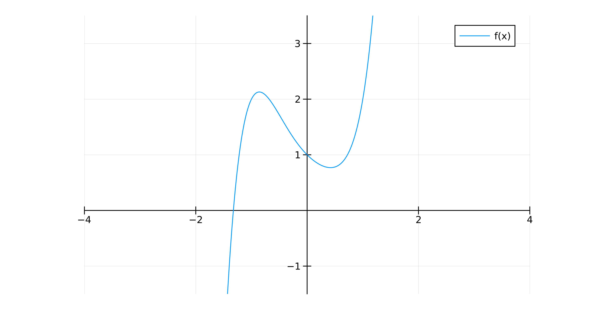
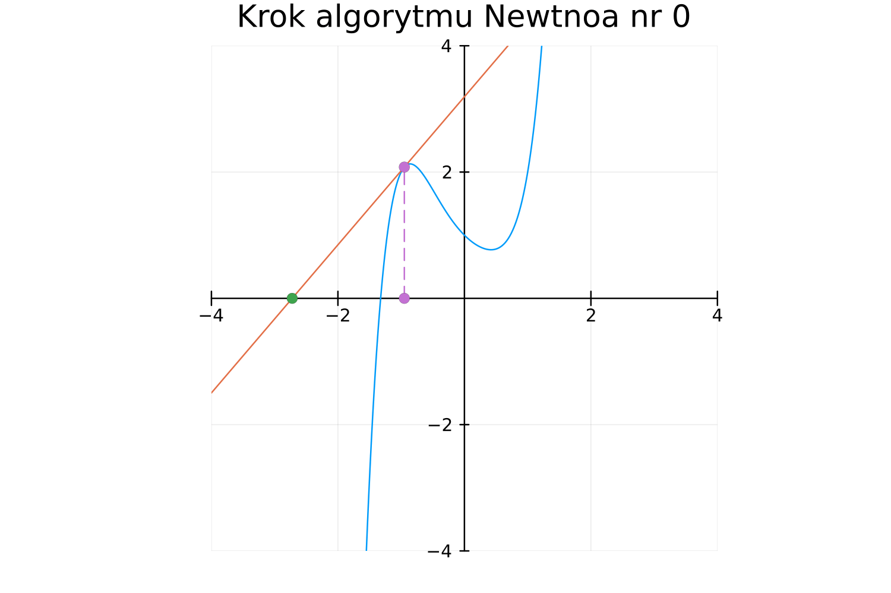
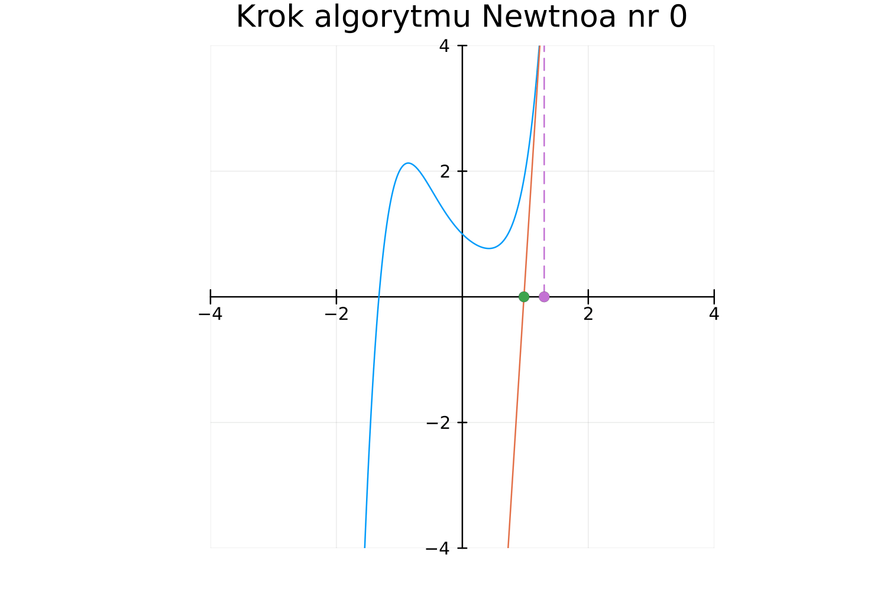
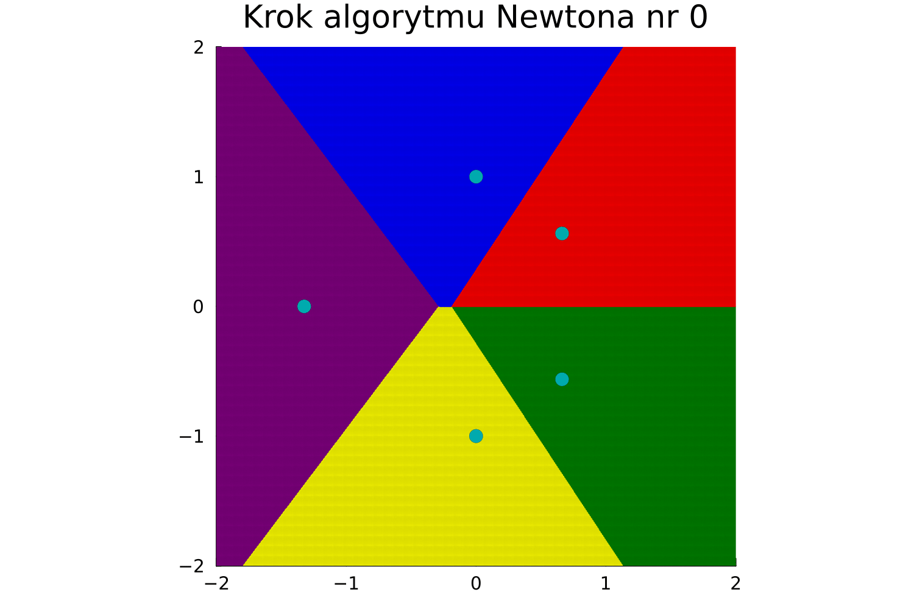
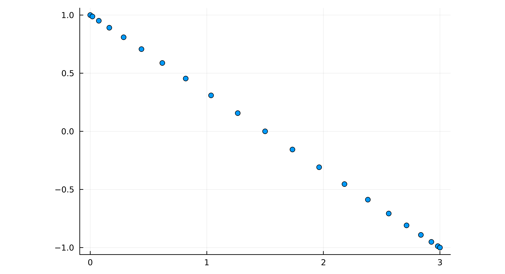

# Wstęga Newtona

Projekt z przedmiotu Optymalizacja Nieliniowa.

Autor: Vitalii Morskyi.

Projekt został zainspirowany opracowaniem 3Blue1Brown,
które jest dostępne na [tej stronie](https://www.3blue1brown.com/lessons/newtons-fractal).

### Wprowadzenie

Przyjmijmy, że potrzebujemy znaleźć rozwiązania równania
$$f(x) = 0$$
gdzie $f(x)$ - dowolny wielomian. Dla przykładu weźmy
$$f(x) = x^5 + x^2 - x + 1 = (x^2 + 1)(x^3-x+1)$$
Zobaczmy jak wygląda wykres funkcji $f(x)$



Kod źródłowy w języku Julia:

```julia
using Plots
func1(z) = z^5 + z^2 - z + 1
plot(-2:0.01:2, func1.(-2:0.01:2), xlims=(-4, 4), ylims=(-1.5, 3.5), framestyle = :origin, label="f(x)", aspect_ratio=:equal)
```

Jak widzimy, równanie $f(x) = 0$ ma tylko jedno rozwiązanie rzeczywiste w punkcie $x \\approx -1.32472$.

### Rozwiązywanie równań metodą Newtona

Spróbujmy teraz rozwiązać to równanie za pomocą metody Newtona:
$$x_{n+1} = x_n - \\frac{f(x)}{f'(x)}$$
Zobaczmy jak wygląda poszukiwanie pierwiastka równania $f(x) = 0$, jeżeli za punkt początkowy wybieramy $x=-0.95$:


Uruchommy teraz ten sam algorytm, tylko zaczynając od punktu $x=1.3$:


Jak widzimy, jeżeli zaczynamy w punkcie w pobliżu rozwiązania, to algorytm bardzo szybko dochodzi do rozwiązania. Jeżeli
natomiast wybieramy punkty trochę oddalone od pierwiastka, to dość często algorytm zaczyna oscylować wokół minimum
lokalnego funkcji. Po niektórej ilość iteracji rozwiązanie jednak się znajduje, ale staje się to tylko dlatego, że
algorytm przypadkowo wyrzuca nas w stronę prawdziwego rozwiązania.

### Przejście do liczb zespolonych

Naszą funkcją jest wielomian piątego stopnia. Dla liczb rzeczywistych istnieje tylko jedno rozwiązanie równania 
$f(x) = 0$. Wiemy jednak, że w przestrzeni liczb zespolonych istnieją wszystkie 5 rozwiązań danego równania. Spróbujmy 
więc rozwiązać to równanie metodą Newtona na przestrzeni liczb zespolonych.

Niestety nie możemy pokazać wykresu funkcji $f(x)$ w przestrzeni liczb zespolonych, ponieważ wymagałoby to użycia
czterech wymiarów. Możemy natomiast pokazać, jak przesuwa się $x$ w przestrzeni liczb zespolonych z każdym krokiem
algorytmu. W poniższej animacji przedstawione są poszczególne kroki poszukiwania pierwiastków równania $f(x) = 0$ dla
pewnego zbioru liczb zespolonych.


Zróbmy teraz jeszcze ciekawszą animację: z każdym krokiem algorytmu Newtona wyznaczmy, do którego rozwiązania najbliżej
znajduje się każdy punkt. Pokolorujmy teraz te punkty w zależności od ich najbliższego rozwiązania i narysujmy ich w
punktach, z których wychodzili. Otrzymujemy bardzo ciekawy wizerunek, który nazywany jest Wstęgą (Fraktalem) Newtona.



Jak widzimy, na każdej krawędzi dwóch pierwiastków pojawiają się takie dziwne wizerunki, w których obecne są wszystkie
kolory. Oznacza to, że z obszaru takiej krawędzi możemy dostać się do dowolnego pierwiastka równania. Nie jest to zbyt
oczywiste, dlatego narysujmy najpierw proces poszukiwania pierwiastka metodą Newtona dla jakiegoś zbioru punktów, które
znajdują się całkiem w środku jednego obszaru. Na przykład, niech wszystkie punkty będą z niebieskiego obszaru z
powyższej animacji.

Jak widzimy, wszystkie punkty w całkiem oczywisty sposób dążą do najbliższego pierwiastku.

Zróbmy teraz to samo, tylko zaczynać będziemy z krawędzi obszarów dwóch pierwiastków równania.

Jak widzimy, po kilku krokach algorytmu punkty zostają rozrzucone po całej płaszczyźnie. Możliwie ta animacja trochę
lepiej tłumaczy, w jaki sposób z krawędzi obszarów dwóch pierwiastków możemy dostać się do każdego pierwiastka równania.

### Optymalizacja funkcji metodą Newtona

Analogicznie do algorytmu poszukiwania pierwiastków równania możemy szukać jego minima i maksima lokalne. Wystarczy po
prostu szukać punktów, w których pierwsza pochodna funkcji jest równa zero. Czyli algorytm Newtona dla poszukiwania
minimów i maksimów funkcji zapisujemy następująco:
$$x_{n+1} = x_{n} - \frac{f'(x)}{f''(x)}$$
Poszukiwanie minimum lokalnego funkcji metodą Newtona, zaczynając od punktu $x=0.5$ z dokładnością 
$\\epsilon = 1\cdot10^{-10}$:

```
[Iteracja = 0] [x = 0.50000] [newx = undefined]
[Iteracja = 1] [x = 0.50000] [newx = 0.43056]
[Iteracja = 2] [x = 0.43056] [newx = 0.42140]
[Iteracja = 3] [x = 0.42140] [newx = 0.42127]
[Iteracja = 4] [x = 0.42127] [newx = 0.42127]
[Iteracja = 5] [x = 0.42127] [newx = 0.42127]
0.4212656495912001
```

### Kod w języku Julia 

#### Użyte biblioteki zewnętrzne

- `Printf` - pozwala na dokładne sterowanie wypisywaniem tekstu do konsoli. 
- `Plots` - odpowiada za rysowanie wykresów w języku Julia.

```julia
using Printf
using Plots
```

#### Funkcje pomocnicze dla animacji

Dla animacji przejść od jednej liczby zespolonej do drugiej potrzebna była funkcja, wyliczająca równanie prostej pomiędzy dwoma takimi punktami na płaszczyźnie. 


Równanie prostej z dwóch liczb urojonych:
```julia
function line_eq(A::Complex, B::Complex)
    x1, y1 = real(A), imag(A)
    x2, y2 = real(B), imag(B)
    return x -> (y2 - y1) / (x2 - x1) * (x - x1) + y1
end
```
Żeby punkt ładnie rozpędzał się i spowalniał się w animacjach, za pomocą funkcji $\\sin$ przygotowano specjalny skrypt, który rysuje więcej punktów na początku i na końcu przejścia prostej, natomiast środek prostej jest pusty: 
$$g(x) = \frac{\sin(x\pi - \frac{\pi}{2})}{2}\cdot(x_2 - x_1) + x_1$$

Wykorzystując powyższą funkcję, możemy otrzymać następujący rozkład punktów na prostej:


Jeżeli będziemy wyświetlać każdy punkt po kolei w równych odcinkach czasu, to pojawi się wrażenie przyspieszenia się i spowalniania się punktu.

Funkcja dla ładnej sekwencji x-ów
```julia
function scaled_xs(A::Complex, B::Complex)
    x1, x2 = real(A), real(B)
    return x -> (sin((x - 0.5)pi) + 1) * (x2 - x1) / 2 + x1
end

using Plots
xs = scaled_xs(1im, 3-1im).(0:0.05:1)
ys = line_eq(1im, 3-1im).(xs)
scatter(xs, ys, aspect_ratio=:equal)
```

#### Pochodne numeryczne

Przygotowany pakiet funkcji potrafi pracować całkiem bez podania pochodnych funkcji, dlatego niezbędne są funkcje, 
liczące pochodne numeryczne według poniższych wzorów:
$$f'(x) = \frac{f(x+h) - f(x-h)}{2h}$$
$$f''(x) = \frac{f(x+h) - 2f(x) + f(x-h)}{h^2}$$

Domyślnie parametr $h$ wynosi $1\cdot10^{-4}$, ale można go zmienić z poziomu dowolnej funkcji, która korzysta z pochodnych numerycznych. Wszystkie funkcje, które wykorzystują pochodne, zawsze mają opcjonalny parametr, pozwalający przekazać dokładną funkcję pochodnej.

Pochodne numeryczne:
```julia
function diff(func::Function, x::Any; h::Float64=1e-4, args...)
    return (func(x + h; args...) - func(x - h; args...)) / (2h)
end

function diff2(func::Function, x::Any; h::Float64=1e-4, args...)
    return (func(x + h; args...) - 2func(x; args...) + func(x - h; args...)) / (h^2)
end
```

#### Równanie stycznej do funkcji w punkcie

Dla niektórych algorytmów niezbędnym było zaimplementowanie funkcji, która zwraca funkcję stycznej w punkcie $x_0$:
$$g(f, x_0)(x) = f'(x_0)(x-x_0) + f(x_0)$$
Funkcja stycznej do innej funkcji w punkcie x0
```julia
function tangent(func::Function, x0::Any; diff_func::Union{Function,Nothing}=nothing, args...)
    if isnothing(diff_func)
        return x -> diff(func, x0; args...) * (x - x0) + func(x0)
    else
        return x -> diff_func(x0) * (x - x0) + func(x0)
    end
end
```

#### Algorytmy Newtona

Zostały przygotowane 3 funkcje, dotyczące algorytmu Newtona: 
1. `newton_step` - oblicza poszczególny krok algorytmu.
2. `newton_find_roots` - poszukuje pierwiastków równania $f(x) = 0$.
3. `newton_optimise` - poszukuje punkty, w których pochodna funkcji $f'(x) = 0$.
        
Funkcje powiązane z algorytmem Newtona:
```julia
function newton_step(func::Function, x::Any; diff_func::Union{Function,Nothing}=nothing, args...)
    if isnothing(diff_func)
        return x - func(x) / diff(func, x; args...)
    else
        return x - func(x) / diff_func(x)
    end
end

function newton_find_root(func::Function, x::Any; tol::Float64=1e-3, verbose::Bool=false, max_steps::Number=1e3,
args...)
    newx = undef
    iteration = 0
    if verbose & isa(x, Complex)
        @printf("[Iteracja = %3d] [x = %10.5f + i(%10.5f)] [newx = undefined]\n", iteration, real(x), imag(x))
    elseif verbose
        @printf("[Iteracja = %3d] [x = %10.5f] [newx = undefined]\n", iteration, x)
    end
    while true
        newx = newton_step(func, x; args...)
        iteration += 1
        if verbose & isa(x, Complex)
            @printf("[Iteracja = %3d] [x = %10.5f + i(%10.5f)] [newx = %10.5f + i(%10.5f)]\n", 
                    iteration, real(x), imag(x), real(newx), imag(newx))
        elseif verbose
            @printf("[Iteracja = %3d] [x = %10.5f] [newx = %10.5f]\n", iteration, x, newx)
        end
        if abs(newx - x) < tol
            break
        end
        if iteration > max_steps
            @printf("Osiągnięto maksymalną ilość iteracji: %s. Przerwanie pętli.\n", max_steps)
            break
        end
        x = newx
    end
    return newx
end

function newton_optimise(x::Any;
                         func::Union{Function,Nothing}=nothing,
                         first_diff::Union{Function,Nothing}=nothing,
                         second_diff::Union{Function,Nothing}=nothing,
                         args...)
    if isnothing(first_diff) & isnothing(func)
        throw(ArgumentError("Neither `func` or `first_diff` was given. At least one of them must be given."))
    elseif isnothing(first_diff)
        first_diff_num(x) = diff(func, x)
        return newton_find_root(first_diff_num, x; diff_func=second_diff, args...)
    else
        return newton_find_root(first_diff, x; diff_func=second_diff, args...)
    end
end
```
#### Chmura punktów 

W celu ułatwienia rysowania animacji w przestrzeni liczb zespolonych została przygotowana struktura (~ klasa)
`PointsCloud`, która przechowywała informację o aktualnym stanie wszystkich punktów, ich kolorach oraz 
ich położeniu początkowym. Zostały również przygotowane dwie funkcji, które działają na 
elementach tej struktury:
1. `step!` - oblicza nowe wartości każdego punktu po kolejnym kroku algorytmu Newtona.
2. `calc_colors!` - oblicza indeksy najbliższych rozwiązań dokładnych do każdego punktu w chmurze. 
    
Struktura `PointsCloud` i jej funkcje:
```julia
mutable struct PointsCloud
    points::AbstractVector
    initial_points::AbstractVector
    colors::Vector{Int64}
    steps::Int64
    
    function PointsCloud(points::AbstractVector)
        return new(points, points, Vector{Int64}(undef, length(points)), 0)
    end
end

function step!(cloud::PointsCloud, func::Function; args...)
    cloud.points = newton_step.(func, cloud.points)
    cloud.steps += 1
end

function calc_colors!(cloud::PointsCloud, centers::AbstractVector)
    closest_centers = Array{Int64,1}(undef, length(cloud.points))
    for (index, point) in enumerate(cloud.points)
        distances = abs.(centers .- point)
        closest_centers[index] = indexin(min(distances...), distances)[1]
    end
    cloud.colors = closest_centers
end
```
    
#### Funkcje animacji

Pozostałe funkcji rysują poszczególne animacje.

Funkcje, rysujące animacje:
```julia
"""Rysuje animację poszukiwania pierwiastka równania metodą Newtona."""
function root_searching_animation(
    func::Function
    ;
    x0::Union{Number, Nothing}=nothing,
    n::Int64=10,
    diff_func::Union{Function, Nothing}=nothing,
    xspan::StepRangeLen=-4:0.1:4,
    yspan::Union{StepRangeLen, Nothing}=nothing,
    filename::String="media/root_searching",
    fps::Int64=1,
    dpi::Int64=200)

    if isnothing(yspan)
        yspan = xspan
    end
    xlims = (minimum(collect(xspan)), maximum(collect(xspan)))
    ylims = (minimum(collect(yspan)), maximum(collect(yspan)))
    if isnothing(x0)
        x0 = rand(xspan)
    end
    anim = @animate for i in 1:n
        pl = plot(xlims=xlims, ylims=ylims, aspect_ratio=:equal, dpi=dpi, framestyle = :origin, legend=false)
        title!(pl, "Krok algorytmu Newtnoa nr $(i-1)")
        plot!(pl, xspan, func.(xspan))
        plot!(pl, xspan, tangent(func, x0; diff_func=diff_func).(xspan))
        next_x0 = newton_step(func, x0; diff_func=diff_func)
        scatter!(pl, [next_x0], [0], ms=4, markerstrokewidth=0.1, markerstrokealpha=1.0)
        plot!(pl, [x0, x0], [0, func(x0)], linestyle=:dash, markershape=:circle, 
        ms=4, markerstrokewidth=0.1, markerstrokealpha=1.0)
        x0 = next_x0
    end     
    gif(anim, "$filename.gif", fps=fps)   
end


"""Rysuje animację kolorowania płaszczyzny względem liczby kroków algorytmu."""
function points_fill_animation(
    func::Function,
    exact_roots::AbstractArray;
    n::Int64=20,
    span::StepRangeLen=-2:0.0085:2,
    filename::String="media/points_fill",
    fps::Int64=4,
    dpi::Int64=200,
    ms::Number=0.5,
    colors_list::Vector{String}=["red", "green", "blue", "yellow", "purple"])

    cloud = PointsCloud(vec([i + j * 1im for i in span, j in span]))
    calc_colors!(cloud, exact_roots)
    xylims = (minimum(collect(span)), maximum(collect(span)))
    anim = @animate for i in 1:n
        pl = plot(xlims=xylims, ylims=xylims, aspect_ratio=:equal, dpi=dpi)
        title!(pl, "Krok algorytmu Newtona nr $(i-1)")
        for j in unique(cloud.colors)
            scatter!(
                pl,
                real(cloud.initial_points[cloud.colors.==j]),
                imag(cloud.initial_points[cloud.colors.==j]),
                ms=ms,
                markerstrokewidth=0.0,
                markerstrokealpha=0.0,
                color=colors_list[j],
                legend=false
            )
        end
        scatter!(
            pl,
            real(exact_roots),
            imag(exact_roots),
            ms=5,
            markerstrokewidth=0.1,
            markerstrokealpha=1.0,
            legend=false
        )
        step!(cloud, func)
        calc_colors!(cloud, exact_roots)
    end
    gif(anim, "$filename.gif", fps=fps)
end


"""Rysuje animacje 'wędrowania' punktów po płaszczyźnie."""
function points_cloud_animation(
    func::Function,
    exact_roots::AbstractArray;
    n::Int64=20,
    frames_per_move::Int64=15,
    fps::Int64=30,
    span::StepRangeLen=-2:0.5:2,
    xspan::Union{StepRangeLen,Nothing}=nothing,
    yspan::Union{StepRangeLen,Nothing}=nothing,
    filename::String="media/points_cloud",
    dpi::Int64=200,
    xylims::Union{Tuple{Number,Number},Nothing}=nothing,
    ms::Number=3)

    if isnothing(xspan)
        xspan = span
    end
    if isnothing(yspan)
        yspan = span
    end
    cloud = PointsCloud(vec([i + j * 1im for i in xspan, j in yspan]))
    calc_colors!(cloud, exact_roots)
    if isnothing(xylims)
        xylims = (minimum(collect(span)), maximum(collect(span)))
    end
    uniform_x_step = 1 / (frames_per_move - 1)
    xs_vec = Vector{Vector{Float64}}(undef, length(cloud.points)) 
    ys_vec = Vector{Vector{Float64}}(undef, length(cloud.points))
    anim = @animate for i in 1:n, j in 1:frames_per_move
        if j == 1
            old_points = cloud.points
            step!(cloud, func)
            calc_colors!(cloud, exact_roots)
            xs_vec = [func.(0:uniform_x_step:1) for func in scaled_xs.(old_points, cloud.points)]
            ys_vec = [func.(xs) for (func, xs) in zip(line_eq.(old_points, cloud.points), xs_vec)]
        end
        pl = plot(xlims=xylims, ylims=xylims, aspect_ratio=:equal, dpi=dpi)
        title!(pl, "Krok algorytmu Newtona nr $(i-1)")
        scatter!(
            pl,
            [x_vec[j] for x_vec in xs_vec],
            [y_vec[j] for y_vec in ys_vec],
            ms=ms,
            markerstrokewidth=0.0,
            markerstrokealpha=0.0,
            legend=false
        )
        scatter!(
            pl,
            real(exact_roots),
            imag(exact_roots),
            ms=5,
            markerstrokewidth=0.1,
            markerstrokealpha=1.0,
            legend=false
        )
    end
    gif(anim, "$filename.gif", fps=fps)
end
```

#### Demonstracja możliwości kodu
    
Finalny kod, wykorzystujący wszystkie funkcje:

```julia
# Wprowadzenie funkcji i jej wcześniej obliczonych pierwiastków (gdy f(z) == 0)
func1(z) = z^5 + z^2 - z + 1
func1_exact_roots = [0.66236 + 0.56228im, 0.66236 - 0.56228im, 0.0 + 1.0im, 0.0 - 1.0im, -1.32472 + 0.0im]

plot(-2:0.01:2, func1.(-2:0.01:2), xlims=(-4, 4), ylims=(-1.5, 3.5),
     framestyle = :origin, label="f(x)", aspect_ratio=:equal)

# Poszukiwanie pierwiastka funkcji za pomocą algorytmu Newtona
newton_find_root(func1, 0.5; verbose=true, tol=1e-10)
newton_find_root(func1, 0.5+2im; verbose=true)
newton_find_root(func1, 1.3; verbose=true)

# Animacja poszukiwania pierwiastków metodą Newtona
root_searching_animation(func1; x0=1.3, n=45, fps=2, dpi=100, xspan=-4:0.01:4, filename="media/root_searching")
root_searching_animation(func1; x0=-0.95, n=9, fps=2, dpi=1050, xspan=-4:0.01:4, filename="media/root_searching_2")

# Poszukiwanie punktów ekstremum funkcji za pomocą algorytmu Newtona.
# Innymi słowy, poszukiwanie pierwiastków funkcji f'(z) == 0.
newton_optimise(0.5; func=func1)
newton_optimise(0.5; func=func1, verbose=true, tol=1e-10)
newton_optimise(0.5; first_diff=x -> 5x^4 + 2x - 1)
newton_optimise(0.5; first_diff=x -> 5x^4 + 2x - 1, second_diff=x -> 20x^3 + 2)
newton_optimise(0.5; func=func1, tol=1e-10, h=1e-10)

# Animację kolorowania płaszczyzny względem liczby kroków algorytmu i najbliższego ostatecznego pierwiastka.
# Wykonanie zajmuje 20-100 sekund
points_fill_animation(func1, func1_exact_roots; n=15, fps=2, dpi=100, span=-2:0.01:2, ms=1)

# Testowanie funkcji potrzebnych dla "rozpędzania i spowalniania" punktów
xs = scaled_xs(1im, 3-1im).(0:0.05:1)
ys = line_eq(1im, 3-1im).(xs)
scatter(xs, ys, aspect_ratio=:equal)

# Animacje poszukiwania punktami swoich pierwiastków. 
# Wykonanie zajmuje 30-120 sekund
points_cloud_animation(func1, func1_exact_roots; n=15, fps=30, frames_per_move=15, dpi=100, span=-2:0.5:2, ms=3)
points_cloud_animation(func1, func1_exact_roots; n=20, fps=30, frames_per_move=15, dpi=100, ms=1.5,
                       filename="media/points_explosion", xspan=-1.75:0.05:-1.25, yspan=0.75:0.05:1.25)
points_cloud_animation(func1, func1_exact_roots; n=5, fps=30, frames_per_move=15, dpi=100, ms=1.5,
                       filename="media/points_no_explosion", xspan=-0.75:0.05:-0.25, yspan=1.25:0.05:1.75)
```
